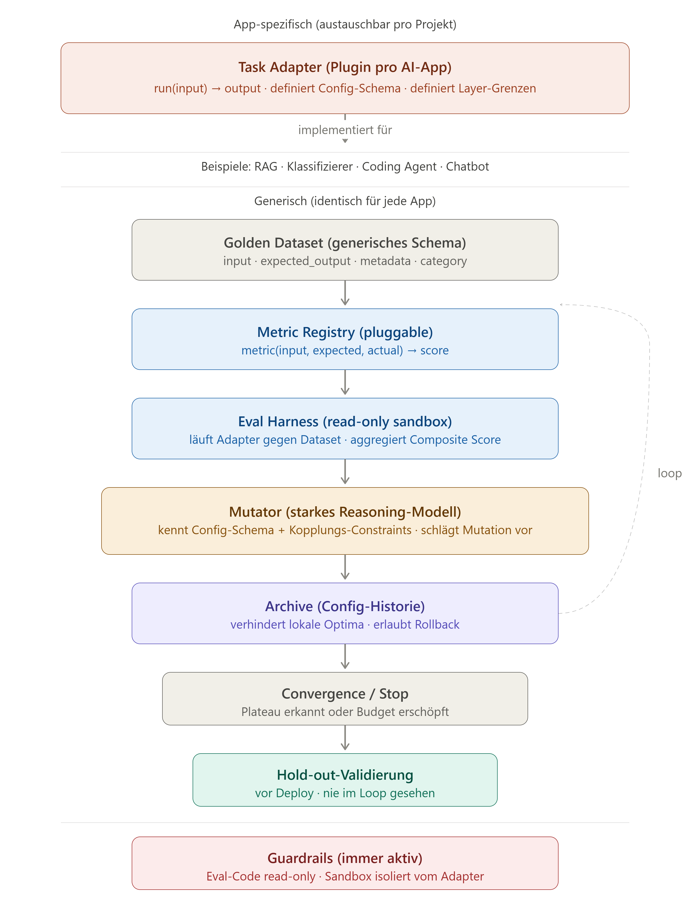

# Agentic Eval Evolution Runtime

A research and architecture repository for eval-guided improvement loops.

The core idea is simple:

```text
system variant -> eval -> score/trace -> patch or mutate -> archive -> gate -> repeat
```

This can run in two modes:

```text
Mode A: Config / Prompt Evolution
AI app config -> TaskAdapter -> eval harness -> mutator -> better config

Mode B: Coding Agent Patch Loop
repo snapshot -> coding agent -> code patch -> tests/benchmark -> rollback or promote
```

This repository is currently an architecture and research package. It does not yet contain runnable implementation code.



## Start Here

Read these first:

1. [Golden_Quality_Setup.md](Golden_Quality_Setup.md)  
   The target architecture, implementation order, eval gates, and coding-agent patch-loop additions.

2. [Generisches_Eval_Harness_Framework.md](Generisches_Eval_Harness_Framework.md)  
   The main framework document, now including section 10 on coding-agent patch mode.

3. [research/2026-07-07-agentic-eval-runtime/report.md](research/2026-07-07-agentic-eval-runtime/report.md)  
   The sourced research report behind the generic eval/runtime architecture.

For coding-agent self-improvement, read this too:

- [research/2026-07-07-coding-agent-patch-loop/report.md](research/2026-07-07-coding-agent-patch-loop/report.md)

## What This Is

This repo explores a generic runtime for improving AI systems without rebuilding the eval loop for every project.

The runtime has two related jobs.

### Mode A: Config / Prompt Evolution

Use this when the target system is an AI app whose behavior can be improved by changing prompts, configs, retrieval parameters, routing choices, model choices, or similar runtime settings.

Examples:

- RAG systems
- classifiers
- chatbots
- tool-using agents

The app implements a `TaskAdapter`. The eval loop, archive, mutator, convergence logic, and guardrails remain reusable.

### Mode B: Coding Agent Patch Loop

Use this when the target system is a codebase and a coding agent is allowed to produce patches until a benchmark, specification, or baseline gate is reached.

Examples:

- fixing project-local regression suites
- resolving SWE-bench-style issues
- improving a coding-agent scaffold
- comparing candidate agent/tooling variants

The eval system is the judge. The coding agent is the patch producer.

## The Golden Setup

The current best setup is:

```text
TaskAdapter
  + DeepEval / Inspect runner
  + RAGAS / ARES metrics for RAG
  + DSPy / GEPA-style optimizer
  + immutable guardrail layer
  + event-sourced archive
  + strict train / validation / holdout / redteam split
```

In plain terms:

- own the adapter/runtime boundary
- reuse mature eval tools where possible
- keep guardrails outside the mutation space
- store every candidate and score in an archive
- optimize on visible splits only
- deploy only after holdout and redteam gates pass

For coding agents, add:

```text
Task / Spec
  -> Repo Snapshot
  -> Coding Agent
  -> Patch
  -> Unit Tests
  -> Benchmark / Regression Oracle
  -> Promote or Roll Back
  -> Archive Lineage
```

## Coding Agent Patch Mode

For coding agents, the runtime has a second mode:

```text
Benchmark / Spec
  -> Coding Agent proposes code patch
  -> Unit tests gate the patch
  -> Benchmark eval compares against best snapshot
  -> Regression triggers rollback
  -> Improvement updates best snapshot
  -> Archive records lineage
```

This is the mode closest to **TDAD's auto-improvement loop**, **SICA**, **Darwin Godel Machine**, and **Huxley-Godel Machine**.

Key distinction:

- the **eval system** is the judge, benchmark, archive, and rollback controller
- the **coding agent** is the patch producer
- the **guardrail layer** protects evaluator, hidden tests, archive, and safety rules from modification

The agent may patch application code or, in an advanced mode, its own scaffold. It must not patch the evaluator, hidden tests, guardrails, or archive.

Reference safeguards to copy from TDAD:

- checksum the evaluation script, e.g. SHA-256
- set evaluator and hidden tests read-only
- run unit tests before benchmark evaluation
- rollback immediately on unit-test failure
- compare every candidate against the best known snapshot
- restore best snapshot after repeated reverts
- report regression rate as a first-class metric, not only resolution rate

The strongest counterpoint comes from the Kitchen Loop: do not treat "benchmark reached" as the whole definition of done. Anchor the loop to a specification surface and regression oracle so the system converges toward product behavior, not just a proxy score.

## Repository Map

| Path | Purpose |
|---|---|
| [README.md](README.md) | Human and agent orientation |
| [Golden_Quality_Setup.md](Golden_Quality_Setup.md) | Best recommended architecture and implementation order |
| [Generisches_Eval_Harness_Framework.md](Generisches_Eval_Harness_Framework.md) | Original German framework document |
| [generic_eval_harness_architecture.png](generic_eval_harness_architecture.png) | Architecture diagram |
| [research/2026-07-07-agentic-eval-runtime/report.md](research/2026-07-07-agentic-eval-runtime/report.md) | Sourced research synthesis |
| [research/2026-07-07-agentic-eval-runtime/plan.yaml](research/2026-07-07-agentic-eval-runtime/plan.yaml) | DeepResearch plan |
| [research/2026-07-07-agentic-eval-runtime/sources.jsonl](research/2026-07-07-agentic-eval-runtime/sources.jsonl) | Source inventory |
| [research/2026-07-07-agentic-eval-runtime/evidence.jsonl](research/2026-07-07-agentic-eval-runtime/evidence.jsonl) | URL-backed claims |
| [research/2026-07-07-agentic-eval-runtime/pages.jsonl](research/2026-07-07-agentic-eval-runtime/pages.jsonl) | Fetched source page text |
| [research/2026-07-07-coding-agent-patch-loop/report.md](research/2026-07-07-coding-agent-patch-loop/report.md) | Coding-agent patch-loop research |
| [research/2026-07-07-coding-agent-patch-loop/sources.jsonl](research/2026-07-07-coding-agent-patch-loop/sources.jsonl) | Patch-loop source inventory |
| [research/2026-07-07-coding-agent-patch-loop/evidence.jsonl](research/2026-07-07-coding-agent-patch-loop/evidence.jsonl) | Patch-loop evidence rows |

## Agent Quickstart

When an agent works in this repo:

1. Read [Golden_Quality_Setup.md](Golden_Quality_Setup.md) first.
2. Read [Generisches_Eval_Harness_Framework.md](Generisches_Eval_Harness_Framework.md) for the original design intent.
3. Use [research/2026-07-07-agentic-eval-runtime/report.md](research/2026-07-07-agentic-eval-runtime/report.md) before making claims about generic eval/runtime tools.
4. Use [research/2026-07-07-coding-agent-patch-loop/report.md](research/2026-07-07-coding-agent-patch-loop/report.md) before making claims about self-improving coding agents.
5. Treat guardrail isolation as non-negotiable.
6. Do not implement a generic eval framework from scratch without checking whether DeepEval, Inspect AI, RAGAS, ARES, DSPy, GEPA, promptfoo, SWE-bench, TDAD, or SICA already cover the need.
7. If adding implementation code, keep the first version adapter-first and small.

Useful first implementation target:

```text
src/
  agentic_eval_runtime/
    adapters.py
    cases.py
    metrics.py
    archive.py
    mutator.py
    runner.py
    reports.py
```

Suggested first CLI:

```text
aer eval --adapter path.to.Adapter --config config.yaml --dataset datasets/validation.jsonl
aer mutate --adapter path.to.Adapter --config config.yaml --dataset datasets/train.jsonl
aer report --archive runs/latest/archive.sqlite
```

Suggested coding-agent CLI:

```text
aer patch-loop --repo path/to/repo --task tasks/001.yaml --baseline baseline.yaml
aer promote --archive runs/latest/archive.sqlite --candidate cand_042
aer rollback --archive runs/latest/archive.sqlite --to-best
```

## Human Quickstart

Use this repo as a decision guide before implementation.

Best reading path:

1. Read the [Golden Quality Setup](Golden_Quality_Setup.md) for the target design.
2. Skim the [framework concept](Generisches_Eval_Harness_Framework.md) to understand the abstraction.
3. Use the [generic research report](research/2026-07-07-agentic-eval-runtime/report.md) to check why the recommended eval tools were chosen.
4. Use the [coding-agent research report](research/2026-07-07-coding-agent-patch-loop/report.md) for TDAD, SICA, DGM, HGM, SWE-bench, and Kitchen Loop context.

Questions this repo answers:

- What should we build ourselves?
- What should we reuse?
- How should a golden dataset be structured?
- How should optimizer-visible data be separated from holdout data?
- How do we prevent the mutation loop from removing safety checks?
- What should the first implementation milestone be?
- How can a coding agent patch toward a benchmark baseline without gaming the evaluator?

## Core Design

### 1. TaskAdapter

Each app implements a small adapter.

```python
class TaskAdapter(Protocol):
    def run(self, case: EvalCase, config: dict) -> RunResult:
        ...

    def get_config_schema(self) -> dict:
        ...

    def get_layer_boundaries(self) -> list[str]:
        ...

    def get_coupling_constraints(self) -> list[dict]:
        ...

    def validate_config(self, config: dict) -> list[ConstraintViolation]:
        ...

    def extract_trace(self, result: RunResult) -> dict:
        ...
```

The adapter is the only part that should be rewritten for each AI application.

### 2. Golden Datasets

Use four sets:

```text
train.jsonl       visible to optimizer
validation.jsonl  used for candidate selection
holdout.jsonl     never visible to mutator
redteam.jsonl     adversarial and regression gate
```

The mutation loop must never see holdout or hidden redteam cases.

### 3. Metrics

Run hard gates before scoring.

Hard disqualifiers include:

- guardrail violation
- forbidden claim
- invalid output schema
- missing required citation
- violated coupling constraint
- unsafe tool permission
- holdout leakage

Only candidates that pass hard gates should receive a composite score.

### 4. Mutator

The mutator gets failure examples, traces, scores, and constraints. It does not get guardrail definitions, holdout cases, hidden redteam cases, or deployment thresholds.

This separation is critical because an optimizer can discover that removing a safety check improves score or latency.

### 5. Archive

Every candidate should be archived, including failures.

Archive fields should include:

- full config
- config patch
- parent candidate
- mutation hypothesis
- scores
- hard-gate result
- trace summary
- failure examples
- cost
- latency
- model versions
- timestamp

### 6. Patch Loop for Coding Agents

For coding agents, the archive must also capture patch lineage:

- task id
- repo snapshot
- patch/diff
- changed files
- commands run
- visible test output
- hidden test summary
- benchmark score
- regression count
- rollback reason
- parent snapshot
- best snapshot at evaluation time

Baseline success should require both resolution and non-regression.

## Build-vs-Buy Guidance

Do not rebuild these from scratch unless there is a clear reason:

- general eval runner: DeepEval or Inspect AI
- RAG metrics: RAGAS / ARES-style metrics
- prompt/module optimization: DSPy
- reflective prompt/config evolution: GEPA-style loop
- prompt/provider regression and red-team checks: promptfoo

Build these locally:

- app-specific adapters
- coupling constraints
- guardrail isolation
- archive schema
- convergence logic
- final release gate
- reports tailored to this runtime

## First Milestone

The first useful implementation should be one of two tracks.

### Track A: Generic Runtime Core

1. typed interfaces for cases, results, metrics, adapters, and archive events
2. one real RAG/MUCi adapter
3. JSONL dataset loading for train, validation, holdout, and redteam splits
4. deterministic metrics first
5. archive written to SQLite or JSONL
6. simple report generator
7. one GEPA-lite mutator over prompt/config text
8. hard guardrail disqualification before scoring

### Track B: Coding Agent Patch Loop

1. task spec with repo snapshot and expected baseline
2. sandboxed coding-agent runner
3. protected evaluator and hidden tests
4. SHA-256 checksum for evaluator scripts
5. unit-test gate before benchmark eval
6. rollback on unit-test failure or regression
7. best-snapshot promotion
8. archive of patches, logs, scores, regressions, and lineage
9. specification/regression oracle inspired by Kitchen Loop

Do not start with a dashboard. A CLI plus reproducible archive is the right first shape for both tracks.

## Research Sources

Primary research artifact:

- [DeepResearch report](research/2026-07-07-agentic-eval-runtime/report.md)
- [Coding-agent patch-loop research](research/2026-07-07-coding-agent-patch-loop/report.md)

Key external references:

- DeepEval: https://github.com/confident-ai/deepeval
- Inspect AI: https://github.com/UKGovernmentBEIS/inspect_ai
- promptfoo: https://github.com/promptfoo/promptfoo
- DSPy: https://github.com/stanfordnlp/dspy
- GEPA: https://github.com/gepa-ai/gepa
- OPRO: https://arxiv.org/abs/2309.03409
- TextGrad: https://arxiv.org/abs/2406.07496
- Agentic Benchmark Checklist: https://arxiv.org/html/2507.02825v2
- TDAD auto-improvement loop: https://arxiv.org/html/2603.17973v1
- SICA: https://arxiv.org/html/2504.15228v2
- Huxley-Godel Machine: https://arxiv.org/abs/2510.21614
- Kitchen Loop: https://arxiv.org/abs/2603.25697

## Current Status

This repository currently contains:

- framework concept
- architecture image
- generic eval/runtime research artifact
- coding-agent patch-loop research artifact
- recommended golden setup
- this README

It does not yet contain implementation code, package metadata, tests, or runnable examples.
